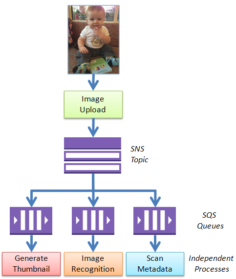

# SQS & SNS using AWSLOCAL

The Amazon `Simple Queue Service (SQS)` and the Amazon `Simple Notification Service (SNS)` are important “glue” components for scalable, cloud-based applications (see the Reference Architectures in the AWS Architecture Center to learn more about how to put them to use in your own applications).

One common design pattern is called “fanout.” In this pattern, a message published to an SNS topic is distributed to a number of SQS queues in parallel. By using this pattern, you can build applications that take advantage parallel, asynchronous processing. For example, you could publish a message to a topic every time a new image is uploaded. Independent processes, each reading from a separate SQS queue, could generate thumbnails, perform image recognition, and store metadata about the image:

[Source: Amazon](https://aws.amazon.com/blogs/aws/queues-and-notifications-now-best-friends/)
